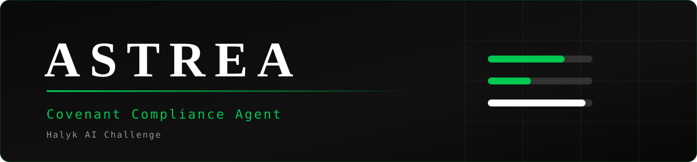

<div align="center">



<br>

[](https://github.com/Pavlentiyys/halykbank-ai-hack/actions/workflows/ci.yml)
[](https://www.python.org/)
[](#результат)
[](#тесты)
[](#offline-режим)
[](https://ollama.com)
[](https://docs.astral.sh/uv/)

**Команда Astrea** · Halyk AI Challenge

</div>

---

## О проекте

Агент читает «грязные» кредитные документы и определяет, нарушены ли финансовые ковенанты
корпоративных займов. На каждую из 36 ячеек (12 заёмщиков × 3 ковенанта) он выдаёт вердикт
`COMPLIANT`/`BREACH`, фактическое значение показателя и транзакцию-доказательство.

Главная сложность датасета не в объёме, а в ловушках: имена файлов обезличены, в леджере нет
колонки категории, рядом с действующим договором лежит недействующая редакция 2024 года, а
черновик аудиторской ведомости предлагает переклассификацию, которую применять нельзя.

### Результат

| | |
|---|---|
| **Сходство с `ground_truth.json`** | **97.2%** — 35.00 из 36 |
| Время полного прогона (offline) | ~7 секунд |
| Тестов | 39 |
| Ошибочных ячеек | 1 (`P5/6.1`) |

---

## Быстрый старт

### Шаг 1. Зависимости

<details open>
<summary><b>Через uv</b> (рекомендуется)</summary>

```bash
# установка uv, если его ещё нет
curl -LsSf https://astral.sh/uv/install.sh | sh

uv sync --extra cli --extra dev
```
</details>

<details>
<summary><b>Через pip</b></summary>

```bash
python3 -m venv .venv
source .venv/bin/activate          # Windows: .venv\Scripts\activate
pip install -r requirements.txt
```
</details>

### Шаг 2. Tesseract (необязательно)

Текстовый слой есть почти у всех PDF, но одна страница из 843 — скан. Без Tesseract прогон
**не падает**, а просто теряет эту страницу: 96.4% вместо 97.2%.

```bash
brew install tesseract tesseract-lang                                    # macOS
sudo apt install tesseract-ocr tesseract-ocr-rus tesseract-ocr-eng       # Debian/Ubuntu
```

### Шаг 3. Данные

Положите рядом с проектом (или укажите путь через `--input`):

```
master_ledger_2025.csv        реестр транзакций по всем заёмщикам
documents/                    200 PDF с обезличенными именами
submission_template.json      36 ячеек, которые нужно заполнить
ground_truth.json             ключ — только для локального скоринга
```

### Шаг 4. Прогон

```bash
python -m cli run --score
```

При первом интерактивном запуске CLI сам предложит поставить Ollama, скачать модель или
продолжить в offline. Хотите проверить всё прямо сейчас, без сети и без модели:

```bash
python -m cli run --offline --no-cache --score
```

Результат — `submission.json` в формате организаторов, готовый к отправке.

---

## Команды

| Команда | Что делает |
|---|---|
| `run` | Полный прогон датасета → `submission.json` |
| `score` | Балл готового сабмишна против ключа по официальной формуле |
| `validate` | Сверка структуры сабмишна с шаблоном организаторов |
| `inspect` | Разбор одной ячейки: обе оценки ансамбля, цитата, документ |
| `train` | Подготовка SFT-корпуса и запуск MLX LoRA |

```bash
python -m cli run --score                                  # прогон + балл
python -m cli run --offline --no-cache                     # детерминированно, без сети
python -m cli run --input data/private --output final.json # другой датасет
python -m cli score submission.json                        # 12 худших ячеек + итог
python -m cli validate submission.json                     # только проверка формата
python -m cli inspect --scenario P1 --covenant 6.3         # почему такой ответ
```

### Флаги

**Общие для `run`, `inspect`, `train`:**

| Флаг | По умолчанию | Назначение |
|---|---|---|
| `--offline` | выкл | Заменяет Gemma детерминированной заглушкой. Ни сети, ни Ollama, ни весов |
| `--no-cache` | выкл | Отключает дисковый кэш ответов модели. Нужен для честного замера времени |
| `--gemma-model` | `gemma4:e2b` | Имя модели в Ollama |
| `--gemma-endpoint` | `http://localhost:11434` | URL Ollama-совместимого сервера |
| `--workers` | `1` | Потоков на 36 ячеек. Против одного инстанса модели больше 2–4 смысла не имеет |
| `--fx-eur-usd` | `1.00` | Курс пересчёта EUR-строк леджера. В документах курса нет — решение принимается явно |
| `--team` | `Astrea` | Поле `team` в сабмишне |
| `--contact-email` | из `cli/settings.py` | Поле `contact_email` в сабмишне |
| `--env-file` | `.env` | Откуда читать переменные окружения |

**Только `run`:**

| Флаг | По умолчанию | Назначение |
|---|---|---|
| `--input` | `.` | Каталог с `documents/`, леджером и шаблоном |
| `--output` | `submission.json` | Куда записать результат |
| `--score` | выкл | После прогона вывести сходство с ключом. Синоним — `--show-score` |
| `--key` | `ground_truth.json` | Файл ключа для `--score` |

**Только `score`:** позиционный путь к сабмишну (по умолчанию `submission.json`) и `--key`.

**Только `validate`:** позиционный путь к сабмишну и `--template` (по умолчанию
`submission_template.json`) — с чем сверять набор ключей.

**Только `inspect`:** `--scenario` (`P1`…`P10`, `B1`, `B4`) и `--covenant` (`6.1`, `6.2`, `6.3`) — оба обязательны.

**Только `train`:** `--data` (куда сложить корпус), `--adapter` (куда сохранить веса),
`--base-model` (базовая модель MLX), `--iters` (шагов обучения).

### Переменные окружения

Читаются из `.env`; аргументы CLI имеют приоритет над ними.

| Переменная | По умолчанию |
|---|---|
| `GEMMA_MODEL_ID` | `gemma4:e2b` |
| `GEMMA_ENDPOINT` | `http://localhost:11434` |
| `MAX_WORKERS` | `1` |
| `FX_EUR_USD` | `1.00` |
| `LLM_CACHE_DIR` | `.llm_cache` |

### Offline-режим

`NullLanguageModel` вместо Gemma: сети нет, весов нет, результат воспроизводим до цента.
Числовой участник ансамбля остаётся на месте — именно он и даёт текущие 97.2%. Режим нужен
для CI, регрессионных тестов и работы без интернета.

---

## Стек технологий

| Слой | Технология | Зачем |
|---|---|---|
| Язык | Python 3.9+ | `Decimal` для денег, `Protocol` для портов |
| Извлечение текста | [PyMuPDF](https://pymupdf.readthedocs.io/) | 843 страницы за секунды, текстовый слой без OCR |
| OCR-фолбэк | Tesseract (`rus+eng`) | Страницы-сканы; отсутствие деградирует, а не ломает |
| LLM | [Ollama](https://ollama.com) + Gemma | Локальный инференс, ключей и внешних API не требует |
| Дообучение | [MLX](https://ml-explore.github.io/mlx/) + `mlx-lm` | LoRA на Apple Silicon |
| Числовая модель | Своя, детерминированная | `actual` оценивается с допуском 5% — регрессор туда не попадёт |
| CLI | `argparse` + [rich](https://rich.readthedocs.io/) | Прогресс и таблицы только в адаптере, ядро о них не знает |
| Тесты | `pytest` | Границы, юниты, end-to-end регрессия |
| Пакеты | [uv](https://docs.astral.sh/uv/) | Лок-файл и быстрая установка |

Внешних API, облачных ключей и векторных БД нет: пакет документов заёмщика — около 35 тысяч
токенов, он целиком помещается в контекст, поэтому retrieval не нужен.

---

## Архитектура

Две директории верхнего уровня и строго односторонняя зависимость между ними.

```
                        ┌──────────────────────────────────────┐
   cli/       ─────────►│               model/                 │
   (сегодня)            │                                      │
                        │   Ансамбль: gemma + числовая         │
   api/       ─────────►│                                      │
   (будущий сервис)     │   Не знает, кто его вызвал,          │
                        │   куда пишется результат             │
   worker/    ─────────►│   и существует ли терминал           │
   (будущая очередь)    └──────────────────────────────────────┘
```

`model/` — самодостаточный пакет: копируется в другой репозиторий и подключается к любому
сервису без единой правки.

```
model/
├── domain/           типы и правила. Нулевые зависимости
├── ports/            Protocol-интерфейсы. Ядро зависит только от них
├── adapters/         PyMuPDF, CSV, Ollama, кэш, заглушка — заменяются поштучно
├── ensemble/         участники, политика разрешения, оркестрация
├── services/         контекст, метрики, matching, пайплайн
├── config.py         Settings — frozen dataclass, без чтения env
└── composition.py    сборка графа объектов: Settings → CovenantPipeline

cli/
├── commands/         run, score, validate, inspect, train
├── presenters/       rich-прогресс, отчёт, запись файла
├── runtime.py        интерактивная установка Ollama и выбор модели
└── settings.py       .env + argv → model.Settings
```

### Ансамбль

Участники отвечают на **разные** вопросы, поэтому не конкурируют, а закрывают слабости
друг друга.

| Что решается | Кто | Почему он |
|---|---|---|
| Действующий документ или редакция 2024 г. | **gemma** | Признак текстовый, в шапке страницы |
| Определение ковенанта и порог | **gemma** | Формулировка уникальна у каждого заёмщика |
| Связанные стороны из KYC | **gemma** читает, **числовая** матчит | Таблица — текст, сопоставление — строгое |
| Категория операции по `description` | **gemma** | Колонки категории в леджере нет |
| `actual` | **числовая** | `Decimal`, без арифметики нейросети |
| `status` | **числовая** | Сравнение с порогом — вычисление, не суждение |
| `evidence_txn_id` | **числовая** | Перебор: какую строку убрать, чтобы вердикт перевернулся |

`NumericAuthoritativePolicy` разрешает расхождения по полям: числа берутся у детерминированного
участника, семантика — у языковой модели. Несовпадение вердиктов попадает в `has_disagreement`
и печатается в отчёте — это самый дешёвый детектор того, что модель прочитала не тот документ.

Добавить третьего участника — значит написать класс с `Estimator`. Ни `ensemble.py`, ни политика
при этом не меняются.

### Принципы, зашитые в тесты

| Принцип | Где | Тест |
|---|---|---|
| `model/` не знает о `cli/` | запрет импортов, `argparse`, `print` | `test_boundaries.py` |
| `model/` импортируется автономно | копия пакета в чистом каталоге | `test_boundaries.py` |
| `services/` и `ensemble/` не выбирают адаптеры | зависимость только от `ports/` | `test_boundaries.py` |
| Сбой участника не топит ячейку | `try/except` вокруг каждого | `test_ensemble.py` |
| Валидный ответ есть всегда | дефолты кладутся до обработки | `test_ensemble.py` |
| Числа берёт числовая модель | политика разрешения | `test_ensemble.py` |
| Балл не проседает | offline-прогон против ключа | `test_regression.py` |

---

## Как это работает

1. **Разбор документов.** Все 200 PDF читаются один раз. Документ привязывается к заёмщику по
   номеру счёта `ACC-*` в тексте — имена файлов обезличены, папок по заёмщикам нет. Отбор по
   названию компании не работает: 124 документа упоминают заёмщика, но это корпоративный шум.
2. **Сборка контекста.** Для каждого заёмщика: действующий договор, аудиторское дело, KYC-досье,
   строки леджера, связанные стороны с долей ≥ 20%, транзакции с пустой суммой.
3. **Анализ ячейки.** Оба участника ансамбля дают полную оценку с уверенностью по полям.
4. **Разрешение.** Политика собирает ответ: числа от одного, семантика от другого.
5. **Сериализация.** `actual` приводится к модулю и округляется до двух знаков — расходы в
   леджере отрицательные, а по правилам значение всегда положительное.

---

## Тесты

```bash
pytest -q                          # всё
pytest tests/test_boundaries.py    # только архитектурные границы
pytest tests/test_regression.py    # только end-to-end регрессия
```

Регрессионный тест прогоняет весь пайплайн offline и падает, если балл опустится ниже 35.00.
Занимает 7 секунд, сети не требует — поэтому и живёт в CI.

---

## Публичный API

```python
from model import DatasetRef, Settings, build_pipeline

pipeline = build_pipeline(Settings())
submission = pipeline.run(DatasetRef("."))
payload = submission.to_submission_dict()
```

`run` возвращает объект и **ничего не пишет на диск** — сериализация остаётся заботой адаптера,
поэтому будущий HTTP-эндпоинт отдаст JSON прямо в ответе.

`pipeline.analyze_one(task, context)` принимает готовый `BorrowerContext`: сервис сможет передать
контекст в теле запроса, не читая PDF внутри эндпоинта.

---

## LoRA-обучение (Apple Silicon)

```bash
uv sync --extra cli --extra dev --extra train

python -m cli train \
  --input . \
  --base-model mlx-community/gemma-3-1b-it-4bit \
  --data artifacts/training-data \
  --adapter artifacts/adapters/gemma-covenants \
  --iters 50 \
  --offline --workers 1 --no-cache
```

Корпус делится по заёмщикам: `P1–P8` — train, `P9–P10` — validation, `B1`/`B4` — test. Задачи:
классификация документов, извлечение KYC, определение ковенантов, категоризация операций.
Ответы из `ground_truth.json` в корпус **не попадают** — он используется только скорером.

> Обученный адаптер пока не подключается к инференсу: `GemmaClient` ходит в Ollama, а MLX-адаптер
> в safetensors требует отдельной конвертации. Ветка экспериментальная и на текущий балл не влияет.

---

<div align="center">

**Astrea** · Halyk AI Challenge · 2025

</div>
